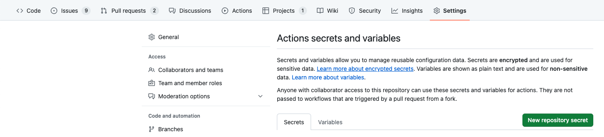

<p align="center"><a href="https://github.com/InfuseAI/piperider" target="_blank"></a></p>

# **PipeRider Compare Action 🚀**

The PipeRider Compare Action is a GitHub Action built on [PipeRider](https://github.com/InfuseAI/piperider). It allows you to run the PipeRider Compare tool directly from your GitHub repository so you can merge Pull Requests with confidence.

## **Description 🔍**

This action runs the PipeRider Compare tool and enables you to compare different versions of your DATA 📊. You can use this action to test the quality of your DATA and identify any kinds of issues. So whether you're a developer 🧑‍💻, a data engineer 🧑‍🔧, or a data scientist 🧑‍🔬, the PipeRider Compare Action can help you ensure that your data is top-notch!

<p align="center">
  
</p>

## **Usage**

### Basic Usage

In order to use the PipeRider Compare Action, you must have a PipeRider project, and create a workflow file in your GitHub repository that specifies this action as one of the steps. It is important to note that this action is only triggered by the pull_request event.

When defining your workflow, you may need to add permissions to the `pull-requests` field in order to enable the action to write to pull requests. You can do this by adding the permissions field as shown below:

To use the PipeRider Compare Action, you can follow the example below:

```yaml
name: PR with PipeRider

on: [pull_request]

jobs:
  piperider-compare:
    runs-on: ubuntu-latest
    permissions:
      pull-requests: write
    steps:
    - uses: actions/checkout@v3

    - name: PipeRider Compare
      uses: InfuseAI/piperider-compare-action@v1
```

### DBT Integration
If you are using dbt to manage your data transformation and want to leverage PipeRider to automate data reliability testing, you need to configure your dbt project and GitHub repository settings properly.  We show you how to do this with snowflake as an example.

First, to install a specific adapter, you need a requirements.txt file that lists the dependencies for your project.

```text
piperider[snowflake]
dbt-snowflake
```

Second, you need to put your dbt profiles.yml file under your dbt project root directory in your GitHub repository. This file contains the connection information for your data warehouse and the target schema for your dbt models. PipeRider will use this file to connect to your data source and profile your models.

```yaml
jaffle_shop:
  target: dev
  outputs:
    dev:
      type: snowflake
      account: "{{ env_var('SNOWFLAKE_ACCOUNT') | as_text }}"

      # User/password auth
      user: "{{ env_var('SNOWFLAKE_USER') | as_text }}"
      password: "{{ env_var('SNOWFLAKE_PASSWORD') | as_text }}"

      role: "{{ env_var('SNOWFLAKE_ROLE') | as_text }}"
      database: "{{ env_var('SNOWFLAKE_DATABASE') | as_text }}"
      warehouse: "{{ env_var('SNOWFLAKE_WAREHOUSE') | as_text }}"
      schema: "{{ env_var('SNOWFLAKE_SCHEMA') | as_text }}"
      threads: 4
```

Third, you need to set the environment variables for your dbt profiles in the setting page of your GitHub repository. Go to Settings -> Secrets and variables -> New repository secret and add the above secrets:



Finally, you need to declare the environment variables in your GitHub workflow yaml file. This file defines the steps for running PipeRider on every pull request. You can use the following template as a reference:

```yaml
name: PR with PipeRider

on: [pull_request]

jobs:
  piperider-compare:
    runs-on: ubuntu-latest
    permissions:
      pull-requests: write
    steps:
    - uses: actions/checkout@v3

    - name: PipeRider Compare
      uses: InfuseAI/piperider-compare-action@v1
      env:
        SNOWFLAKE_ACCOUNT: ${{ secrets.SNOWFLAKE_ACCOUNT }}
        SNOWFLAKE_USER: ${{ secrets.SNOWFLAKE_USER }}
        SNOWFLAKE_PASSWORD: ${{ secrets.SNOWFLAKE_PASSWORD }}
        SNOWFLAKE_ROLE: ${{ secrets.SNOWFLAKE_ROLE }}
        SNOWFLAKE_DATABASE: ${{ secrets.SNOWFLAKE_DATABASE }}
        SNOWFLAKE_WAREHOUSE: ${{ secrets.SNOWFLAKE_WAREHOUSE }}
        SNOWFLAKE_SCHEMA: ${{ secrets.SNOWFLAKE_SCHEMA }}
```

### (Optional) PipeRider Cloud Usage

<details><summary>Host results on PipeRider Cloud by:</summary>
  
PipeRider Cloud provides an interface for navigating, generating additional comparisons, and sharing results with team members. To use PipeRider Cloud:

1. [Sign up for PipeRider Cloud](https://cloud.piperider.io/signup) to obtain your `cloud_api_token`. Your default cloud project will come with a `cloud_project` id.
2. Add `cloud_api_token` and `cloud_project` parameters to your Action like so:

```yaml
name: PR with PipeRider

on: [pull_request]

jobs:
  piperider-compare:
    runs-on: ubuntu-latest
    permissions:
      pull-requests: write
    steps:
    - uses: actions/checkout@v3

    - name: PipeRider Compare
      uses: InfuseAI/piperider-compare-action@v1
      with:
        cloud_api_token: ${{ secrets.API_TOKEN }}
        cloud_project: ${{ secrets.PROJECT }}
        upload: true
        share: true
```

The **`upload`** parameter, the action will upload the comparison result to the cloud. The **`share`** parameter is used to generate a shareable link for the comparison result.
  
</details>

We hope these guidelines will help you use the PipeRider Compare Action effectively in your projects.

<hr/>

### **Inputs for PipeRider Compare Action**

The following inputs are available for the PipeRider Compare Action. You can use these inputs to customize the comparison process according to your requirements.

### Basic Parameters

The following basic parameters are available:

| Input | Required | Description |
| --- | --- | --- |
| github_token | No | This input is optional and can be set as GITHUB_TOKEN or as a personal access token with repository access. The default value is ${{ github.token }}. |
| recipe | No | This input is optional and allows you to specify the recipe to use for the comparison. If not specified, the default recipe located at .piperider/compare/default.yml will be used. |

### (Optional) PipeRider Cloud Parameters
<details><summary>The following parameters are available for using PipeRider Cloud:</summary>

  These parameters only work when the **`cloud_api_token`** has been set.

  | Input | Required | Description |
  | --- | --- | --- |
  | cloud_api_token | No | This input is optional and allows you to specify the API token to use for the PipeRider Cloud API. If not specified, the default API token will be used. |
  | cloud_project | No | This input is optional and allows you to specify the cloud project to use for the comparison. If not specified, the default project will be used. |
  | upload | No | This input is optional and allows you to specify whether to upload the comparison results to PipeRider Cloud. If set to true, the comparison results will be uploaded. The default value is false. |
  | share | No | This input is optional and allows you to specify whether to create a share link for the comparison results. If set to true, a share link will be created. The default value is false. |
  
</details>

We hope this guide will help you use the PipeRider Compare Action more effectively.


### **Outputs**

This GitHub Action provides two outputs that can be used in subsequent steps in the same job:

- **`status`**: The exit code status of the PipeRider comparison. This indicates whether the comparison was successful or not.
- **`uuid`**: The UUID of the repository that was compared.

## **Support**

If you encounter any issues or have any questions about the PipeRider Compare Action, please **[open an issue](https://github.com/InfuseAI/piperider-compare-action/issues/new)**.
